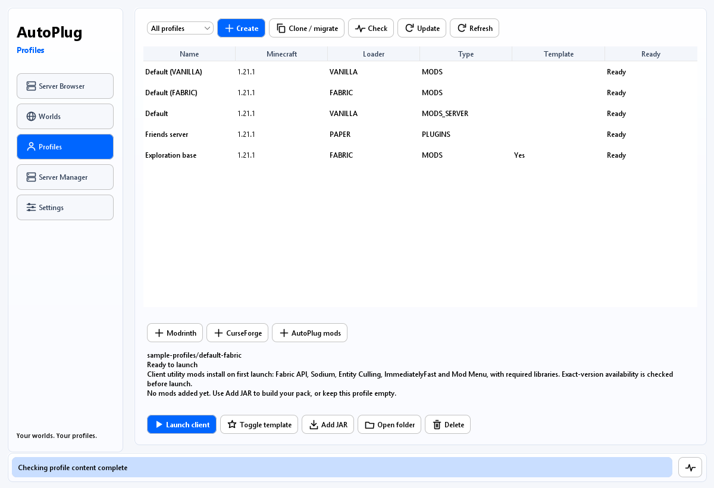
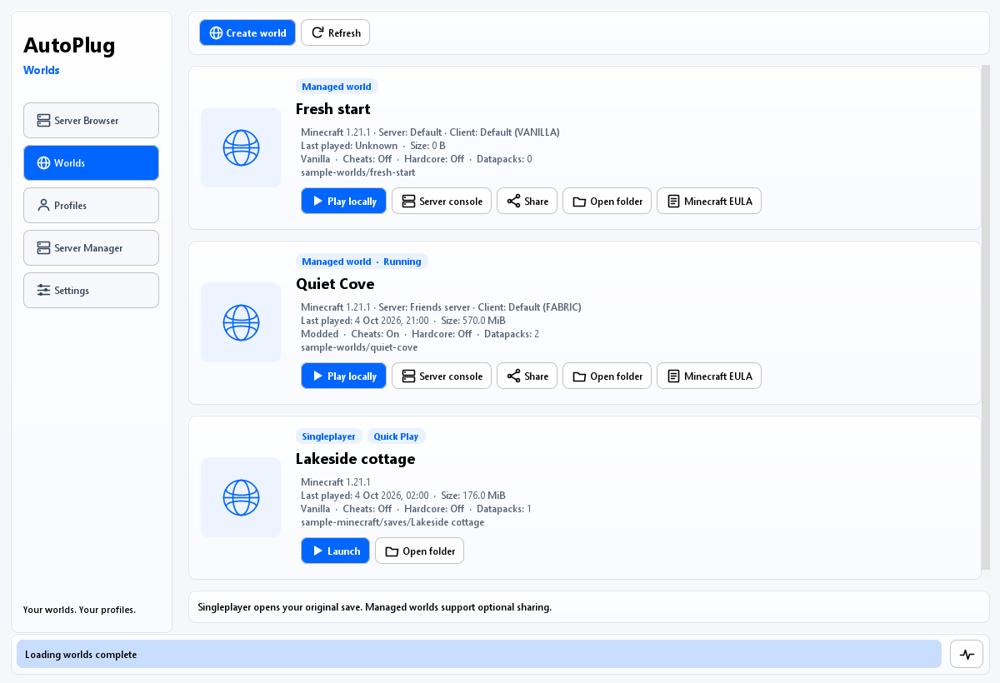
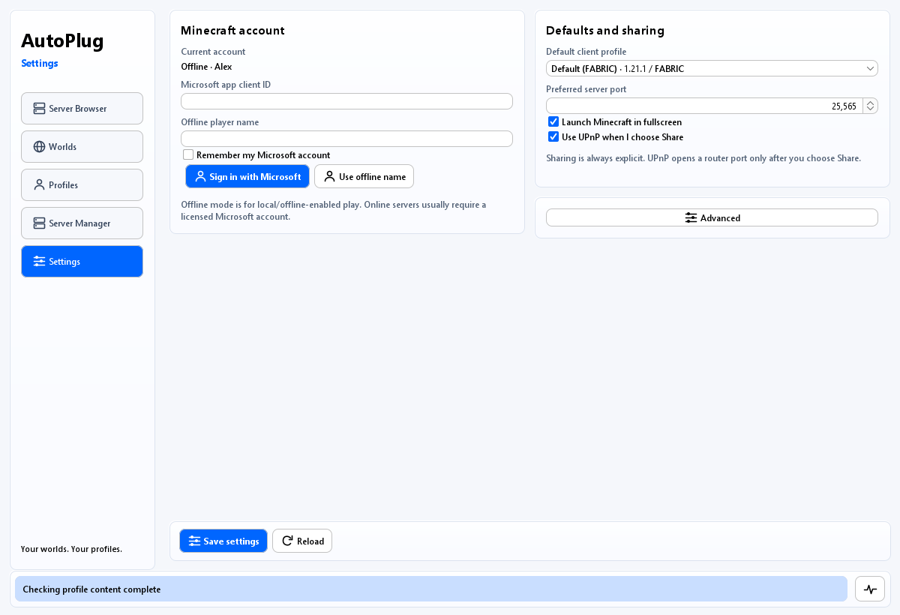
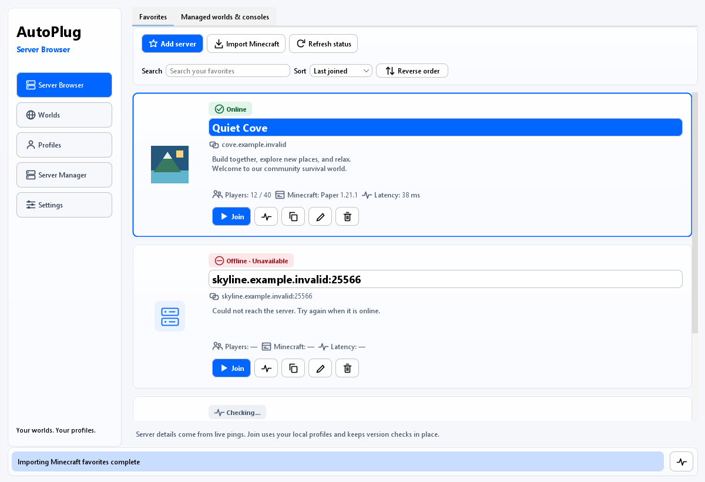

# Native Minecraft launcher, profiles and worlds

AutoPlug's desktop dashboard includes **Server Browser**, **Worlds**, **Profiles**, **Server Manager** and **Settings**. The launcher downloads Minecraft metadata, libraries, assets and loader components directly; it does not embed another launcher. The existing server wrapper and updater commands remain available. Light is the default theme: rounded frosted panels sit on a clean off-white canvas, with blue accents for primary actions, selected navigation and focus. Existing dark or Darcula preferences remain supported.

AutoPlug targets Java 9 or later. Minecraft runs in a separate JVM selected from its version metadata. Settings supports Java 8, 17 and 21 executable overrides and additional `major=path` entries. If no matching runtime is configured or already installed, AutoPlug uses its Adoptium provider to download one. Runtime availability depends on the operating system and architecture.

## Desktop workflow

Enable the existing system-tray option in AutoPlug's general configuration and click the tray icon to open the dashboard. Closing the window hides it; it does not stop AutoPlug or its running worlds. When the operating system has no system tray, the dashboard opens as a normal window.

The header names the current tab, and common actions have icons with text or accessible labels. Long operations run in background workers. An overall progress bar advances while work is active and reaches completion when the operation succeeds. **Overall progress is an estimate**, not a measurement of all remaining work; the tooltip separately reports current-file bytes and percentage when known. The current source URL can be selected and copied, and **Activity details** keeps a copyable history of steps and download sources. Download URLs also appear in logs with sensitive credentials redacted. Settings keeps account and sharing controls visible in two compact columns; **Advanced** expands optional runtime overrides.

1. **Profiles** prepares three defaults for the configured Minecraft version, initially `1.21.1`: `Default (VANILLA)` client, `Default` Vanilla server, and `Default (FABRIC)` client utilities. Creating these entries is offline; game files and the Fabric utility collection download only when selected for launch. An existing usable default preference is preserved; a template or pending migration is replaced as the launch default without changing that profile. Version-specific defaults are reused rather than retargeting an existing profile. Create additional client profiles with type `MODS`, a Minecraft version and a loader. Vanilla also uses `MODS`, with loader `VANILLA` and an empty collection.
2. Add mod or plugin JARs to the profile's collection directory, available through **Open folder**, or use `.profiles add` below. Provider identities in `collection.json` allow version-aware update checks; `.profiles add --modrinth` records a Modrinth project ID or slug.
3. In **Settings**, select an offline player name or sign in with Microsoft. Minecraft starts fullscreen by default; the **Fullscreen** preference controls subsequent client launches. Configure runtime overrides only if automatic selection is unsuitable.
4. Use **Launch client**, or select a server in **Server Browser** and choose a compatible client profile. If no client profiles exist, the dashboard prepares defaults before continuing. The browser shows Minecraft version, MOTD, player count and latency through AutoPlug's existing status ping. A server's reported version is not proof that every installed mod will be compatible; review the selected loader and collection.

Server Browser presents compact favorites with a server icon, address, distinct online/offline state, MOTD, player count, reported version and latency. The status ping supplies the server's icon when available: AutoPlug accepts bounded 64 × 64 PNG data and uses its local fallback icon for absent or invalid images. It does not follow arbitrary image URLs. The generic imported name `Minecraft Server` is displayed as the server address. Each entry keeps Join, Ping, Copy address, Edit and Remove nearby. The initial sort is **Last joined**, newest first; search, alternative sorts, reverse order and keyboard navigation remain available. History is recorded after the client process starts for that target, which does not prove that the multiplayer connection succeeded.

The browser imports favorites from the standard Minecraft `servers.dat` when the dashboard starts. Importing reads the vanilla file and keeps AutoPlug favorites separately; it does not rewrite the vanilla file. Favorites can also be added through the dashboard or CLI.

Joining a server or launching a world opens a chooser with large profile buttons. AutoPlug remembers a ready profile per target and falls back to an eligible configured default or the world's selected client. When a preferred choice is available, a visible two-second countdown starts it. **Wait, let me select something else…** cancels that countdown and leaves the choices open; selecting another profile uses it immediately. Closing the chooser cancels it. Deleted, template, pending-migration or incompatible choices are not silently reused. Existing singleplayer saves still require a Vanilla profile with their exact recorded version.

Native client preparation downloads independent libraries, native archives, the client JAR and assets with at most eight workers and a bounded queue. Verified cached files are reused. Retryable connection and HTTP failures get up to three attempts; invalid metadata, file-system failures and cancellation are not retried indefinitely. A failed or interrupted batch cancels outstanding HTTP requests and workers. Loader installers can run their own download processes; their source URLs and output appear in the same activity history. This describes background preparation cancellation, not a separate general-purpose Cancel button in the dashboard.

### Dashboard previews

These previews render the actual Swing components with synthetic fixture data at 1200 × 820 and 950 × 620 pixels in light and dark themes. They show layout and controls; they do not demonstrate live Microsoft authentication, server connectivity, gameplay or router sharing. The [reproducible fixture helper and instructions](testing/README.md) include the sample data. Icons, logs and progress are synthetic; the progress preview uses a fixed estimated position, not a download measurement.

**Profiles:** isolated client and server collections, reusable templates, and migration controls.



**Worlds:** existing singleplayer saves and separate managed server worlds in one place. Only managed server worlds expose sharing and server EULA controls.



**Settings:** default profile, sharing preference and account controls, with runtime overrides under **Advanced**.



**Server Browser:** responsive cards show fixture connection states and server details; action icons retain labels or accessible tooltips.



Additional Server Browser previews show the [dark theme](images/native-launcher/server-browser-dark.png) and [compact 950 × 620 layout](images/native-launcher/server-browser-compact.png). Profiles shows the full first-launch utility summary in its [compact layout](images/native-launcher/profiles-compact.png). Settings previews show the [dark theme](images/native-launcher/settings-dark.png), [compact account view](images/native-launcher/settings-compact.png) and [fullscreen/sharing controls after scrolling](images/native-launcher/settings-fullscreen-compact.png).

**Managed console:** each selected managed world has its own console, command entry and lifecycle controls, shown with sample logs in [light](images/native-launcher/managed-console.png) and [compact dark](images/native-launcher/managed-console-dark-compact.png) layouts.

**Profile chooser:** large profile buttons and the red countdown-cancel control are shown in [light](images/native-launcher/launch-chooser.png), [dark](images/native-launcher/launch-chooser-dark.png) and [compact](images/native-launcher/launch-chooser-compact.png) component previews.

**Activity:** the current step stays readable above the overall progress fill, with a copyable source URL below it. See the synthetic [light](images/native-launcher/overall-progress.png), [dark](images/native-launcher/overall-progress-dark.png) and [compact](images/native-launcher/overall-progress-compact.png) previews.

## Profiles and migration

| Type | Purpose | Collection folder |
| --- | --- | --- |
| `MODS` | Native Minecraft client, vanilla or modded | `mods/` |
| `PLUGINS` | Dedicated server with plugins | `plugins/` |
| `MODS_SERVER` | Dedicated server with mods, or vanilla server | `mods/` |

Client loaders are `VANILLA`, `FABRIC`, `QUILT`, `FORGE` and `NEOFORGE`. Virtual-world server installation supports vanilla, Fabric, Quilt, Forge and NeoForge, and plugin servers such as Paper, Spigot and Purpur through AutoPlug's existing server updater. Bukkit selects the Spigot build path. Proxy software such as Velocity or BungeeCord cannot host a virtual world. Versions must exist in the selected provider's metadata; Spigot installation additionally runs BuildTools and requires its build prerequisites, including Git.

Mark reusable packs as **templates**, then clone them before playing. A clone has its own configuration and collection metadata. Changing its game version or loader marks migration as pending. AutoPlug checks the target version, including downgrades, and shows a summary before applying changes. A pending migration cannot be launched.

**Check** finds compatible releases without downloading or installing them. **Update** applies the reviewed plan. Downloads are staged and verified before installed JARs are replaced. During a confirmed migration, artifacts without a compatible release or sufficiently precise provider identity become `name.jar.disabled`; they are retained for recovery. A provider/network error is reported separately and blocks application rather than being interpreted as incompatibility. Configuration files are preserved.

Modrinth and CurseForge identities support target-version checks. A generic GitHub, Spigot or custom update URL may not describe game/loader compatibility, so it cannot by itself establish compatibility during migration. The existing provider integrations still handle ordinary updates where applicable.

The Profiles tab links to [Modrinth](https://modrinth.com/mods) and [CurseForge](https://www.curseforge.com/minecraft) for browsing additional mods. These open the provider in the browser; downloaded user-selected JARs still belong in the chosen profile's collection.

### Default Fabric utilities

The additional Fabric client uses a deliberately small recipe from the requested utility list: **Fabric API, Sodium, Entity Culling, ImmediatelyFast and Mod Menu**. Required provider-declared libraries are included recursively; the current Minecraft 1.21.1 selection also needs **Text Placeholder API**. The preset adds no map, shader pack or gameplay-changing mod and does not require these utilities on the server. A server can still enforce its own mod rules.

On its first launch, AutoPlug resolves listed stable Fabric releases for the exact Minecraft version. It rejects server-required dependencies, conflicting required versions, declared incompatibilities and server-only artifacts. Optional dependencies are not added. The complete dependency plan is resolved before downloading, and every downloaded JAR is staged, size/checksum checked and inspected for Fabric metadata before any part of the collection is activated. Duplicate dependencies and cycles do not cause repeated installs.

If a compatible release is absent, the provider fails, a download is invalid, or activation fails, the launch reports the error and leaves no active partial preset. Existing user mods in an uninstalled default are preserved and cause an explicit conflict instead of being overwritten. After a successful install, normal launches do not query the provider or re-seed removed mods; deliberate customization remains intact. Provider identities are retained in `collection.json` so subsequent changes use the ordinary **Check**/**Update** workflow. The Fabric marker and version make default creation idempotent, including after renaming the profile. This recipe does not promise availability for every historical Minecraft release.

Profiles in use are locked against concurrent update, clone or delete operations. Deleting a profile moves it into recoverable trash; profiles referenced by saved worlds must be detached or their worlds removed first.

## Commands

Commands can be entered in AutoPlug's interactive console. They can also be passed directly to the executable JAR:

```text
java -jar AutoPlug-Client.jar .profiles list
```

The examples below show the command portion. Replace `PROFILE_ID`, `CLONE_ID`, `SERVER_PROFILE_ID`, `CLIENT_PROFILE_ID`, `WORLD_ID` and `REGISTERED_CLIENT_ID` with actual values. Creation commands print generated IDs. Quote names and file paths containing spaces.

```text
.profiles list
.profiles list --type mods-server
.profiles create "Fabric base" 1.20.1 FABRIC --type mods --template
.profiles create "Local server" 1.20.1 PAPER --type plugins
.profiles add PROFILE_ID "path/to/example.jar" --modrinth PROJECT_ID_OR_SLUG
.profiles template PROFILE_ID
.profiles template PROFILE_ID --off
.profiles clone PROFILE_ID 1.20.4 --name "Updated pack" --loader FABRIC
.check mods --profile CLONE_ID
.update mods --profile CLONE_ID --yes
.check plugins --profile SERVER_PROFILE_ID
.update plugins --profile SERVER_PROFILE_ID
.profiles delete PROFILE_ID --yes
```

Use `mods` for both `MODS` and `MODS_SERVER`, and `plugins` for `PLUGINS`. A CLI update prints a fresh plan. Migration requires `--yes`, which explicitly authorizes the reported replacements and disabling of unresolved artifacts. Clone also accepts `--yes` to apply its migration immediately; omit it when you want to review first. The examples use `--profile` to select the isolated collection explicitly.

```text
.mc account offline LocalPlayer
.mc launch CLIENT_PROFILE_ID
.mc launch CLIENT_PROFILE_ID --server example.org:25565
.mc launch CLIENT_PROFILE_ID --server example.org --port 25566
.mc servers add "My server" example.org:25565
.mc servers import
.mc servers list
```

Server listing imports vanilla favorites and pings each saved server. Direct `.mc launch` selects the supplied profile; the dashboard provides the profile selection and clone/migration workflow.

## Microsoft accounts

Microsoft sign-in requires a **registered public application client ID** configured in Settings. The application must support the device authorization flow for personal Microsoft accounts and be permitted to access the Minecraft services it calls. AutoPlug does not ship a borrowed launcher ID or require a client secret. A missing or unapproved application registration cannot be repaired by entering an account password into AutoPlug.

Choose **Sign in with Microsoft**, then complete the displayed device-code instructions on Microsoft's verification page. AutoPlug exchanges the resulting authorization through Xbox services, checks Minecraft Java Edition entitlement and retrieves the Minecraft profile. Account policy, entitlement and application-registration failures are reported to the user.

**Remember Microsoft account on this computer** is optional and off by default. When enabled, account and refresh tokens are stored in the launcher's local `accounts.json` with owner-restricted permissions where the filesystem supports them. This is local credential storage, not an encrypted credential vault. Leave it unchecked for an in-memory session.

```text
.mc account microsoft REGISTERED_CLIENT_ID
.mc account microsoft REGISTERED_CLIENT_ID --remember
```

Use the first command in a running AutoPlug console to keep sign-in within that session. A standalone command exits after sign-in, so a later independent JAR invocation needs either a new sign-in or the explicit `--remember` option. Offline names provide a local test identity; they do not authenticate to Microsoft-backed multiplayer servers.

## Existing singleplayer saves

**Worlds** scans `saves/` in the standard Minecraft directory: `%APPDATA%/.minecraft` on Windows, `~/Library/Application Support/minecraft` on macOS, and `~/.minecraft` on Linux. Its bounded `level.dat` reader exposes name, recorded version, modded status, last-played time, enabled datapacks, cheats and hardcore settings. Cards also show a validated `icon.png`, save size and Quick Play eligibility where known. Local saves and managed worlds are ordered by newest known activity, considering recorded last play, creation and file modification times. Size scanning does not follow links and stops at its entry, depth or time budget; an incomplete size is labeled **At least**. Datapack display is capped. Refresh rescans the folder. Discovery does not copy, convert, rename or rewrite saves; malformed or linked entries are skipped with a diagnostic. A problem reading the local saves root does not hide valid managed worlds.

Choose **Launch** on a singleplayer card to open the original save using Vanilla Minecraft and the account selected in Settings. The recorded game version is preserved, including the exact pre-release or release-candidate build. A save with no recorded version requires you to choose its original version explicitly; AutoPlug never chooses an upgrade automatically. Saves marked as modded must be opened using their original modded setup to preserve their contents.

When the publisher's version metadata advertises singleplayer Quick Play, AutoPlug passes the save folder name directly to Minecraft. For supported pre-Quick-Play versions with Mojang client mappings (1.14 onward), a bundled Java 8 startup helper resolves the exact version's native world-entry methods. The older releases **1.7.10, 1.8.9, 1.12.2 and 1.13.2** use bundled adapters pinned to the original client JAR's SHA-1; those adapters were checked against original JAR bytecode and MCP mappings. Other pre-mapping builds, or unsupported mapping layouts, fail with an explicit compatibility error. This does not claim support for every historical snapshot.

The helper schedules Minecraft's normal integrated-world loading flow on the game thread, preserving the original game folder and the save's display name. It does not invent unsupported command-line flags, convert the save to a dedicated server or bypass account authentication. A launch status confirms that the game was started with automatic entry configured; it does not prove that world loading completed. Helper validation failures and timeouts are logged. Launching allows Minecraft to write its normal save, options and log files in the original game directory. Back up important saves before playing. AutoPlug serializes its launches in that shared directory and leaves Minecraft's own world locking in place.

Preparing a local launch registers a stable `world-<uuid>` ownership entry under AutoPlug's data root. This entry contains only a reference to the validated original save; it does not move or copy its contents. Repeated launches reuse the same entry and do not add duplicate cards. Existing `local:<folder>` command aliases continue to work after the displayed ID becomes `world-<uuid>`.

The CLI uses the same discovered IDs and version checks:

```text
.mc worlds list
.mc worlds launch "local:My World"
.mc worlds launch "local:Older World" --version 1.12.2
```

Use `--version` only to supply a missing original version; an override that differs from a save's recorded version is rejected. Singleplayer saves have no AutoPlug dedicated server, server EULA flag or UPnP sharing action. Leave the world or use **Open to LAN** from Minecraft's own menu. Quitting AutoPlug leaves these local games running so Minecraft can save and exit normally; close them from Minecraft itself.

## Managed worlds and sharing

In **Worlds**, create a managed world with a server profile and a playable client profile. Matching defaults are prepared when needed; they do not accept the server EULA. The profiles must use the same game version. Non-Vanilla modded servers also require matching client loaders; a Vanilla server can use a modded client, including the default Fabric utilities. Each world owns a separate save directory, even when multiple worlds use the same server profile. Mod/plugin JARs are materialized from the profile; world-specific configuration and saves remain separate. An existing world icon or server icon is shown as its thumbnail when available, and the bounded save metadata appears after the world has a readable `level.dat`.

Read and accept the [Minecraft EULA](https://aka.ms/MinecraftEULA) for the world before launching it. AutoPlug does not silently accept it during profile creation or server installation. The CLI flag below records that explicit choice:

```text
.mc worlds create "Local world" SERVER_PROFILE_ID CLIENT_PROFILE_ID
.mc worlds launch WORLD_ID --accept-eula
.mc worlds list
.mc worlds share WORLD_ID
.mc worlds stop WORLD_ID
```

`--accept-eula` is also supported by `worlds create`. After acceptance is recorded, subsequent launches need no flag. `worlds launch WORLD_ID --share` additionally requests sharing, subject to the settings and account requirements below.

Managed worlds require the packaged `AutoPlug-Client.jar`; running the parent from an IDE classes directory produces an explicit packaging error for this feature. Each world gets a copy of the current AutoPlug JAR under its own `server/autoplug/` directory. That child runs the full legacy server wrapper in the world's isolated working directory, with independent configuration, console input, logs and server process. The wrapper uses the parent's Java 9-or-later runtime; Minecraft uses its separately selected runtime, including Java 8 where needed. The installer's exact argument vector is preserved, including paths with spaces and modern Forge/NeoForge argument files.

Launching starts the child AutoPlug wrapper and a dedicated server bound to `127.0.0.1`, waits for Minecraft status readiness, then connects the native client to it. The preferred port from Settings is used when available; an occupied port causes selection of another free loopback port. Closing the client sends that world's wrapper `.stop both`, allowing its server-saving shutdown hook to run. Startup failures and application shutdown also clean up owned processes, with a bounded graceful wait before termination if they do not exit. Restart tracks the process generation so a previous server exit cannot stop its live replacement.

**Server Manager** selects a managed world and exposes **Play / start**, **Stop**, **Restart**, **Back up**, **AutoPlug help**, **Server status**, **Configuration** and **World folder**. Its console accepts one Minecraft or AutoPlug command at a time and displays the latest 64 KiB of that world's output. Refreshing a console or switching worlds does not route commands to the parent's legacy singleton server. Configuration opens that world's `autoplug` folder; backup and other optional legacy features use its own configuration. Backup is initially disabled and can be enabled there.

The parent owns managed-session lifetime and pinned versions. Child self/Java/server/mod/plugin updaters, recurring update checks and scheduled restarts stay disabled, with comments explaining the policy; use the parent's profile update workflow and the selected world's Restart control. Child startup also disables its own tray, start-on-boot registration, automatic EULA acceptance and crash restart. World-specific keys, backup preferences and unrelated configuration are preserved. Existing authentication checks still apply to optional AutoPlug online services; an unconfigured key does not authorize a remote connection. The local AutoPlug-plugin listener binds loopback and selects a free port independently for each child. These child settings do not change the parent's normal legacy configuration.

Sharing requires all of the following:

- A Microsoft-authenticated world session. Offline worlds use local authentication and remain loopback-only; sign in and relaunch before sharing.
- **Use UPnP when I explicitly share a world** enabled in Settings. This option is on by default but does not itself start sharing; a separate explicit **Share** action is required. Turning it off releases existing owned mappings.
- An explicit **Share** action or `--share` launch flag, plus a compatible gateway with a public IPv4 address.

For sharing, AutoPlug opens a LAN TCP forwarding endpoint to the loopback server and requests a leased UPnP mapping. It reports the external address for friends to use. The Minecraft server itself remains bound to loopback. Closing the world removes the owned forwarding endpoint and mapping; AutoPlug does not overwrite or delete another application's mapping.

If automatic sharing is unavailable, the local world continues and the result explains the failure. A TCP tunnel can target the displayed `127.0.0.1:port`. Manual router forwarding alone cannot reach a loopback-bound server; it also needs an appropriate LAN forwarding endpoint. AutoPlug does not silently alter firewall rules, and a successful mapping is not proof that every upstream firewall permits the connection.

Running sessions belong to the AutoPlug process that launched them. Use its dashboard or interactive console for `share` and `stop`; a second standalone JAR invocation cannot control the first process's in-memory sessions. A standalone world launch keeps AutoPlug running until the session ends. Closing only the dashboard window leaves the session running in the tray.

## Storage and isolation

The default data root is `~/.autoplug`, where `~` means the operating-system user's home directory. To isolate a test installation, set `-Dautoplug.home=PATH` **before** `-jar` and use the same value for every command.

| Location under the data root | Contents |
| --- | --- |
| `profiles/<id>/` | Profile identity, collection metadata, configuration and mod/plugin collection |
| `worlds/<id>/world.json` | World identity, profile references and recorded EULA choice |
| `worlds/<id>/server/` | Dedicated server files, world saves and `autoplug-server.log` |
| `worlds/<id>/server/autoplug/` | Copied AutoPlug executable, exact server command metadata, and this world's legacy wrapper configuration/logs |
| `worlds/world-<uuid>/local-world.json` | Metadata-only ownership reference to an existing singleplayer save; its files remain in Minecraft's original `saves/` directory |
| `cache/` | Shared game downloads, libraries, assets, installer artifacts, content-addressed JARs and runtimes |
| `servers.json` | AutoPlug server favorites and last-join history |
| `settings.json` | Launcher preferences, fullscreen/default-profile/account selection, and remembered target/profile choices |
| `accounts.json` | Credentials only when account persistence is explicitly requested |
| `trash/`, `worlds/.trash/` | Recoverable removed profiles/worlds |

Artifacts use hard links when possible, with symbolic-link or copy fallback. AutoPlug replaces an artifact link when updating instead of overwriting shared bytes. Treat cached JARs and their linked copies as immutable; do not edit their contents in place. Mutable settings and world saves are copied into independent directories. The legacy server's working directory and global updater configuration are not repointed to implement profile operations.

## Verification and optional live smoke checks

The focused automated tests use provider fixtures, real local child JVMs, loopback Minecraft status responses and a simulated UPnP SOAP gateway. They exercise profile isolation, migration, three defaults, transactional Fabric dependency installation, bounded world metadata, newest-activity sorting, ownership references and CLI aliases, launch arguments, account exchanges, process shutdown and mapping ownership without using a real account or changing a router. Additional tests cover bounded server icons, persisted join/profile preferences, the chooser countdown and abort, parallel download retries/cancellation, estimated progress, and per-world console routing. Wrapper tests verify configuration/JAR preparation and real isolated fixture-process control; these tests alone do not prove that the full packaged legacy wrapper or Minecraft game has run.

The final-review automated run reported **189 tests: 188 passed, no failures or errors, and one Windows symbolic-link capability skip**. Java 9 release compilation and Maven packaging passed. The separate packaged-wrapper smoke started two real AutoPlug child instances around fixture JVM servers, verified isolated console commands, restarted one server, stopped it gracefully, and verified that a raw stop of the second server automatically exited its wrapper within 15 seconds. That last check exercises the shutdown hook without holding the server lifecycle lock. No Microsoft sign-in, live multiplayer join or gameplay result is implied by these checks.

Dashboard tests also cover synchronous layout invalidation while measuring Settings. Settings and world-card stacks use GridBagLayout so wrapped text can invalidate its ancestors without clearing BoxLayout's in-progress measurement arrays. Fixture previews check light and dark layouts at 1200 × 820 and 950 × 620.

`DashboardDisplayableTest` additionally creates hidden native Swing peers, validates the actual window/scroll-pane hierarchy, and resizes both themes repeatedly across the Settings column breakpoint. It checks Advanced controls, preserved field edits, scroll reachability, world-card bounds and uncaught event-thread exceptions. It requires a desktop environment, skips in headless mode, and never shows a window or contacts game services. This is automated window-lifecycle coverage, not human acceptance testing or interactive gameplay.

Legacy automatic entry is checked with exact-version mapping fixtures, forked contract clients and original client-bytecode inspection. These checks verify method contracts and scheduling but do not establish successful interactive Minecraft gameplay. Full game loading and play were not verified in the implementation environment; unsupported historical builds are not presented as tested.

From a checkout with Maven and a suitable JDK, run:

```text
mvn "-Dtest=ProfileStoreTest,ProfileUpdatesTest,ProviderCompatibilityTest,LauncherDefaultsTest,FabricDefaultProfileTest,LauncherPreferencesTest,LauncherCommandsTest,LocalClientLifecycleTest,WorldActivityOrderingTest,MinecraftLauncherTest,LegacyWorldLaunchTest,DownloadProgressTest,ParallelDownloadsTest,LegacyDownloadProgressTest,ModrinthArtifactIdentityTest,MicrosoftAccountServiceTest,JavaRuntimeManagerTest,WorldStoreTest,LocalWorldStoreTest,WorldServiceTest,AutoPlugWorldBootstrapTest,ServerProcessObservationTest,MinecraftServerInstallerTest,UpnpSharingServiceTest,ServerBrowserTest,ServerFavoriteHistoryTest,ServerIconTest,ServerStatusIconIntegrationTest,MineStatJsonTest,DashboardPanelTest,DashboardServerRowsTest,LaunchChoicePanelTest,OverallProgressTest,ManagedWorldPanelTest" test
mvn -DskipTests package
```

On a desktop host, run the additional window-lifecycle check explicitly:

```text
mvn -Djava.awt.headless=false -Dtest=DashboardDisplayableTest test
```

The dependency-inclusive executable is `target/AutoPlug-Client.jar`. After packaging, the standalone `ManagedWorldPackagedSmoke` test helper can exercise actual packaged AutoPlug child instances around offline fixture servers. From the checkout on Windows, replace both paths below, using a fresh scratch directory:

```text
java -cp "target/AutoPlug-Client.jar;target/test-classes" com.osiris.autoplug.client.worlds.ManagedWorldPackagedSmoke "C:\path\to\AutoPlug-Client" "C:\path\to\fresh-smoke-directory"
```

Use `:` instead of `;` between the classpath entries on Linux or macOS and supply absolute paths for those systems. The helper creates two isolated wrapper copies, checks readiness through loopback status responses, compares fixture PIDs with owned descendants, routes commands to the correct console, restarts one server and stops both gracefully. It also checks retained managed-policy comments. The fixture writes its own PID/command evidence into the scratch directory. It does not load Minecraft saves, accept the Minecraft EULA, authenticate an account or contact an external server. A passing result establishes the packaged wrapper lifecycle, not gameplay.

A live download/client smoke check is optional and contacts the official game/runtime providers; it may download substantial assets and opens a Minecraft window:

```text
java -Dautoplug.home=./launcher-smoke -jar target/AutoPlug-Client.jar .profiles create "Vanilla smoke" 1.20.1 VANILLA --type mods
java -Dautoplug.home=./launcher-smoke -jar target/AutoPlug-Client.jar .mc launch CLIENT_PROFILE_ID
```

Replace `CLIENT_PROFILE_ID` with the ID from the first command. Check that the selected runtime starts and the client reaches its title screen, then close it. To test Fabric, Quilt, Forge or NeoForge, create a separate profile with that loader and a version the provider supports. A successful metadata download or fixture test alone does not establish that the actual game started.

For a world smoke check, create a matching server profile and world in the same isolated data root. Review the EULA, explicitly accept it if appropriate, launch without `--share`, confirm the client joins its local world and verify that closing the client stops the server. Router sharing should be tested separately only by an operator who explicitly enables it.

Maintainer live validation still includes a registered Microsoft application, real device-code sign-in, entitlement verification, token refresh and a join to an authenticated server. Those outcomes depend on external account/application authorization and are not claimed by fixture-based tests. A real network sharing check also needs a suitable gateway and another client outside the LAN.
